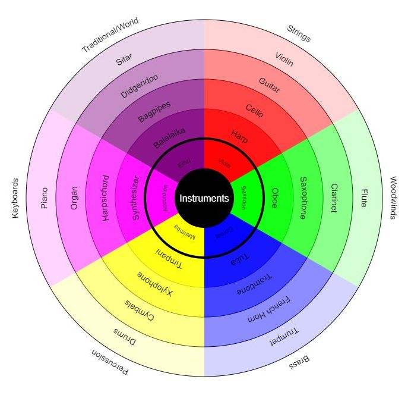

# webCharts - Spider Web Charts / Polar Grids Maker

Creates a Polar (concentric) Grid style chart based on a simple array of categories and elements.



## The Good

* Works for 3-6 category 'slices' and 3-6 'level' circles, with labels on the outside

* Has different colours for each 'slice' and different shades for each 'segment'

* Allows for smaller text and a thicker circle near the centre

* Has a scale variable to increase / decrease the size of the chart

## The Bad

* It has irrelevant level names - which should be read as labels, but are not (due to being used differently in an earlier version)

* The thicker central circle (while optional - just set width to 1 or comment out) could be dynamic if needed

* The font sizing could be relative to the grid size

But it fulfills its basic purpose as is.

## Contents

To change the contents just alter -

```js
    const data = [
      { level: '1', segments: ['A', 'A1', 'A2', 'A3', 'A4', 'A5'] },
      { level: '2', segments: ['B', 'B1', 'B2', 'B3', 'B4', 'B5'] },
      { level: '3', segments: ['C', 'C1', 'C2', 'C3', 'C4', 'C5'] },
      { level: '4', segments: ['D', 'D1', 'D2', 'D3', 'D4', 'D5'] },
      { level: '5', segments: ['E', 'E1', 'E2', 'E3', 'E4', 'E5'] },
      { level: '6', segments: ['F', 'F1', 'F2', 'F3', 'F4', 'F5'] }
    ];
```
